# Bifrost

**Kalundborg Kommunes interne AI-compliance-platform.** Hver vurdering peger på den
ordret-verificerede lovartikel — så sagsbehandlere, jurister og ledere kan tage
trygge beslutninger om AI-indkøb og udvikling.

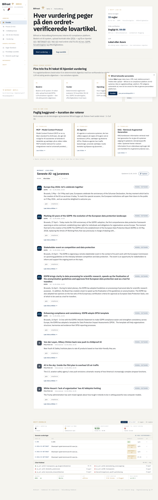

---

## Hvad er Bifrost — i én sætning?

> Et internt værktøj der guider Kalundborg Kommune fra "vi vil bruge AI til X" til
> "her er den hjemlede, dokumenterede beslutning" — uden at sagsbehandleren skal
> være jurist eller AI-forsker.

## Hvorfor det er nødvendigt

EU's AI Act trådte i kraft 2. februar 2025 og indfases gradvist frem til 2027.
Sammen med GDPR, forvaltningsloven, offentlighedsloven og de danske sektorlove
betyder det at en kommune **lovligt skal kunne dokumentere** at:

1. AI-systemer ikke krænker grundlæggende rettigheder
2. Persondata behandles på et lovligt grundlag
3. Sagsbehandlere har tilstrækkelige AI-færdigheder (Art. 4)
4. Højrisiko-systemer er CE-mærket før idriftsættelse
5. Alvorlige hændelser indberettes til Digitaliseringsstyrelsen inden 15 dage

Bryder kommunen reglerne kan det koste **op til 35 mio. euro eller 7% af omsætningen**
i bøder — plus tab af borgernes tillid. Bifrost gør det operationelt muligt at
overholde reglerne uden at hyre en jurist til hver AI-beslutning.

## Hvad får jeg som …

**… leder?**
- Et hurtigt overblik over kommunens samlede AI-portefølje på ét dashboard
- Tydeligt svar på "kan vi købe/bygge dette AI-system?" med GO / BETINGET-GO / NO-GO
- Eksporterbare rapporter (Word + PDF) til kontrakter, ledelsesmøder og myndighedstilsyn

**… sagsbehandler?**
- Trin-for-trin guidning gennem indkøb → EU-tjek → vurdering
- Skabeloner til alle påkrævede dokumenter (DPIA, databehandleraftale, risikostyring m.fl.)
- Smart "næste skridt"-cue der altid fortæller hvor du skal tage fat

**… jurist?**
- Ordret lovcitater med daglig verifikation mod EUR-Lex og Retsinformation
- Per-felt kommentar-tråde med kollegaer
- Audit-trail på alt — uændret, dokumenteret, klar til tilsyn

**… udvikler/IT?**
- Deterministisk regelmotor (ingen LLM-fortolkning af afgørelser)
- 21 deklarative YAML-regler — nemt at læse og udvide
- REST API til alle data, lokal LM Studio-integration eller Azure/OpenAI

---

## 3-trins proces til AI-indkøb og udvikling

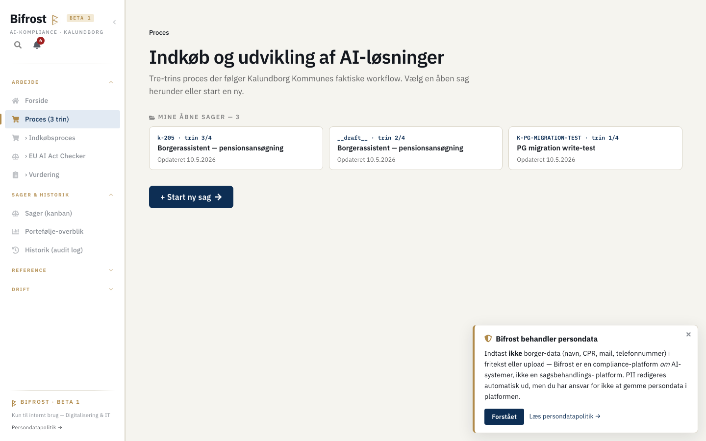

Hele Kalundborg Kommunes AI-workflow på én side. Hvert trin gemmer automatisk,
så sagsbehandleren kan stoppe og fortsætte uden tab.

### Trin 1 — Indkøbsproces

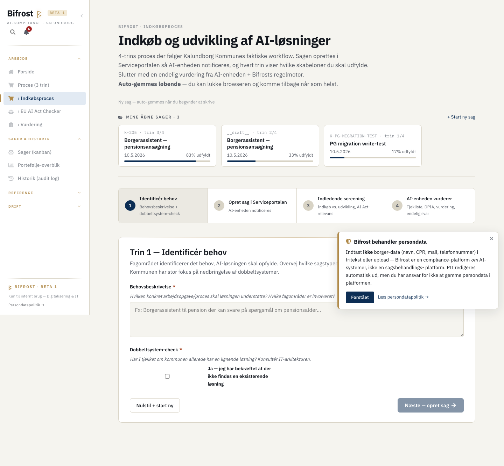

Wizard der indsamler det nødvendige fundament: behovsbeskrivelse,
dobbeltsystem-tjek, om systemet købes eller udvikles, samt 9 evidens-skabeloner
specifikt til indkøb (EU MCC-klausuler, leverandør due-diligence, DPIA-tærskeltest m.fl.).

### Trin 2 — EU AI Act-tjek

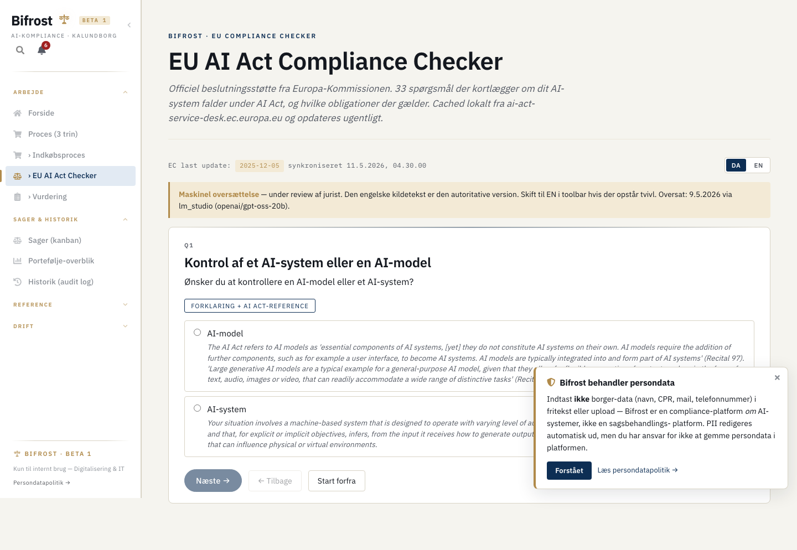

EU's officielle 33-punkts compliance-wizard, integreret direkte i Bifrost.
Klassificerer AI-systemet som **forbudt / højrisiko / begrænset / minimal risiko**
og udløser de relevante krav i Trin 3.

### Trin 3 — Bifrost-vurdering

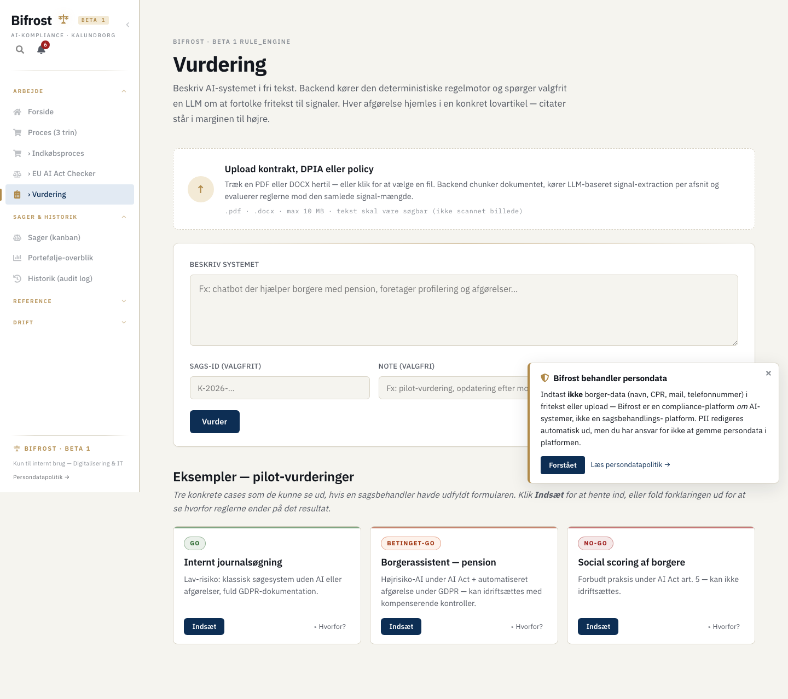

Beskriv AI-systemet i fritekst, eller upload kontrakt/DPIA. En LLM ekstraherer
signaler; **regelmotoren** (ikke LLM'en) træffer afgørelsen ved at evaluere
21 deklarative lovregler. Resultatet er **GO / BETINGET-GO / NO-GO** med
ordret citat fra EU AI Act, GDPR, forvaltningsloven eller offentlighedsloven —
samt en liste over de evidens-artefakter der skal udfyldes inden ibrugtagning.

---

## Sagsstyring

### Sager — kanban-overblik

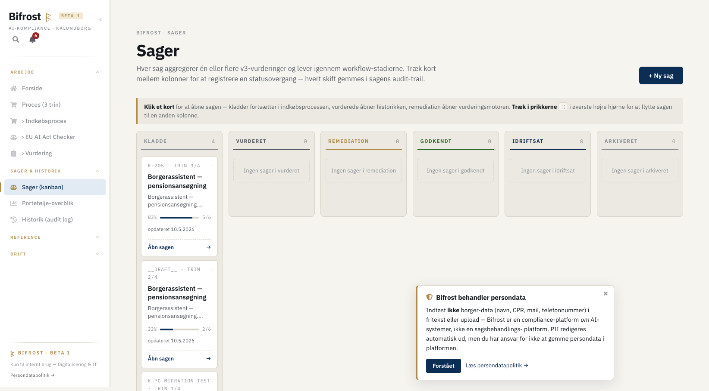

Alle sager grupperet pr. workflow-status: kladde, vurderet, remediation, godkendt,
idriftsat, arkiveret. Træk-og-slip mellem kolonner registrerer en statusovergang
i audit-trailen. Klik et kort for at åbne den fulde sag med evidens, vurderinger
og kommentarer.

### Portefølje-overblik

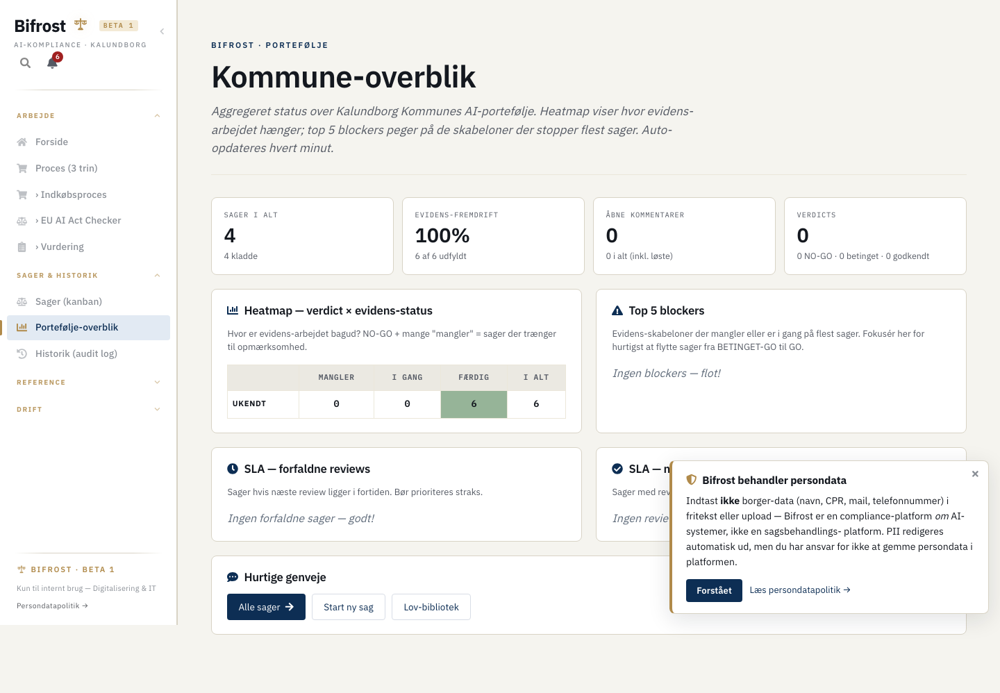

Kommune-niveau aggregat over hele AI-porteføljen — det leder-dashboard man kan
åbne på 30 sekunder og forstå hvor kommunen står:

- **Stats-strip**: total sager, evidens-fremdrift, åbne kommentarer, fordeling af verdicts
- **Heatmap**: verdict × evidens-status (NO-GO + mange "mangler" = røde flag)
- **Top 5 blockers**: hvilke evidens-skabeloner stopper flest sager
- **SLA-lister**: forfaldne reviews + dem der nærmer sig deadline inden for 7 dage

Auto-opdateres hvert minut.

---

## Reference-bibliotek

### Videnbase — 102 termer, auto-opdateret

Levende ordbog over AI-jura og kommunal compliance, fra grundbegreber som
"DPIA" og "Bilag III" til specifikke termer som "FRIA" og "GPAI".
Hvert term er kategoriseret og linket til myndighedskilden. Et ugentligt
job henter nye termer fra EUR-Lex, Datatilsynet, EDPB og Retsinformation.

### Relevante links — 53 kurerede ressourcer

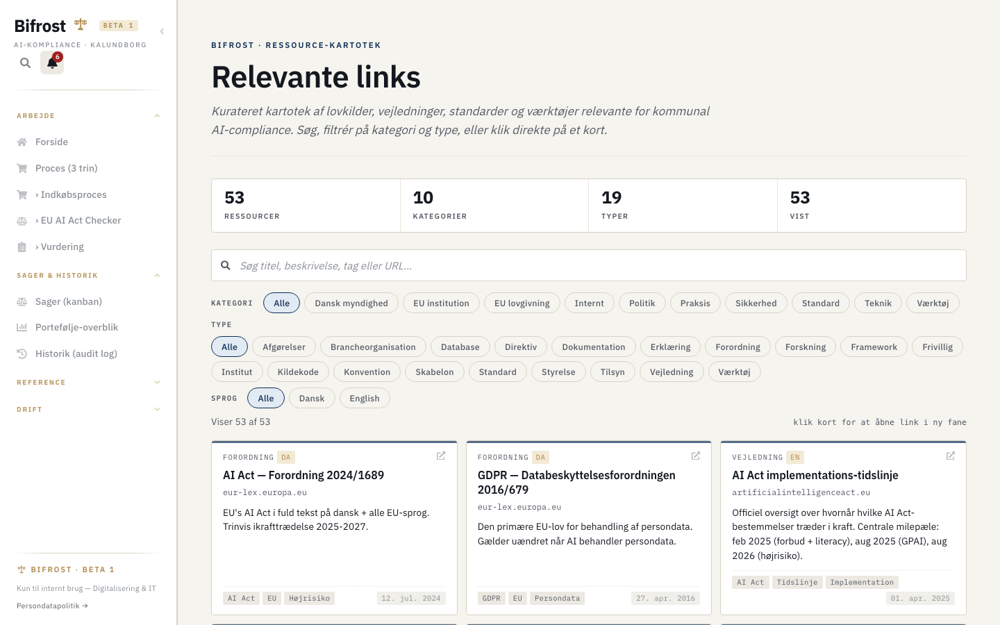

Kartotek over de officielle kilder og standarder en kommune skal kende:
EU MCC-klausuler (24 sprogversioner), KL's inspirationskatalog for AI-færdigheder,
ALTAI selvvurdering, ISO 42001, Digitaliseringsstyrelsens vejledninger og mere.
Filtrérbar på kategori og type.

### AI-løsninger — 143 projekter i offentlig sektor

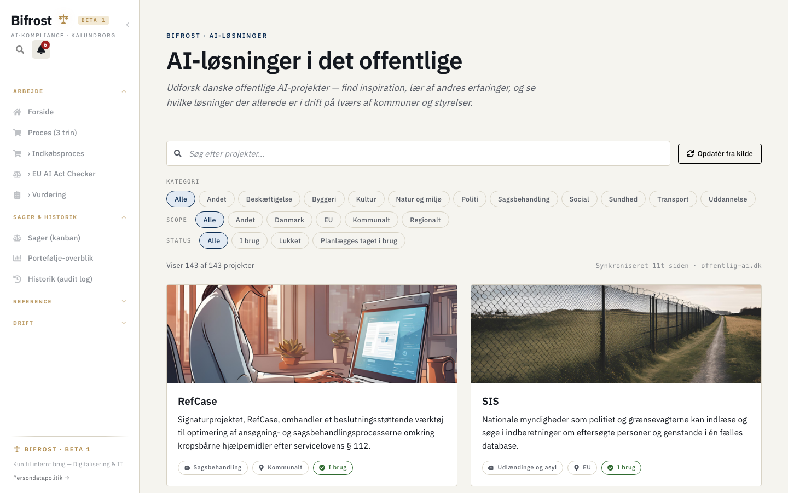

Database over igangværende og afsluttede AI-projekter i den danske
offentlige sektor (sync'et fra offentlig-ai.dk). Brug den til at lære
af andre kommuner: hvilke leverandører bruger de, hvilke fejl har de
gjort, og hvilke kontrakter har de skrevet.

### Lov-assistent

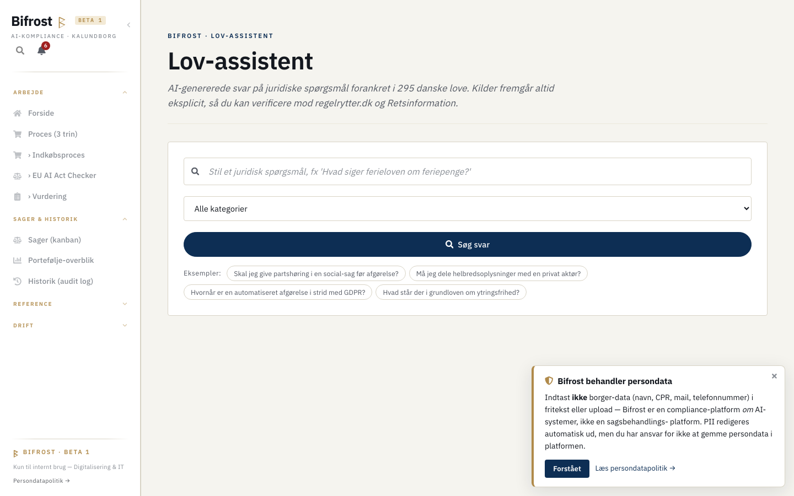

AI-genereret Q&A på 295 danske love. Kilder fremgår altid eksplicit, så
sagsbehandleren kan verificere mod regelrytter.dk og Retsinformation før
en juridisk afgørelse træffes. Eksempler:

- "Skal jeg give partshøring i en social-sag før afgørelse?"
- "Hvornår er en automatiseret afgørelse i strid med GDPR?"
- "Må jeg dele helbredsoplysninger med en privat aktør?"

---

## Interaktive detaljer — sådan føles det at bruge Bifrost

Disse screenshots viser de øjeblikke hvor en sagsbehandler faktisk arbejder
med systemet, ikke bare sidernes layout.

### Sag-detalje med "næste skridt"-cue

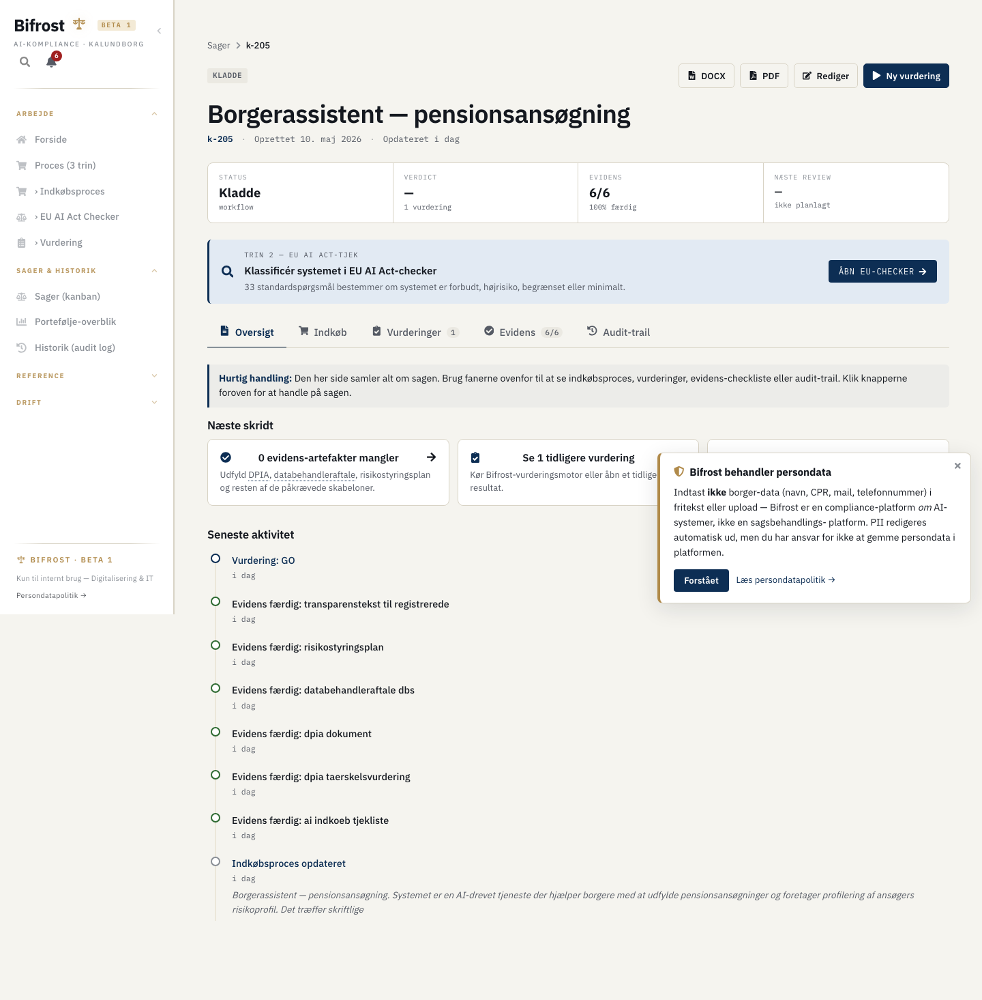

Én sag samler alt: stats-strip med status + verdict + 6/6 evidens-fremdrift,
en stærk CTA der peger på det mest oplagte næste skridt ("Klassificér systemet
i EU AI Act-checker"), fanerne Oversigt / Indkøb / Vurderinger / Evidens /
Audit-trail, og en hurtig-aktioner-grid. Knapperne foroven leverer DOCX, PDF
og ny vurdering med ét klik.

### Evidens-editor med skabelon-bibliotek + kommentarer

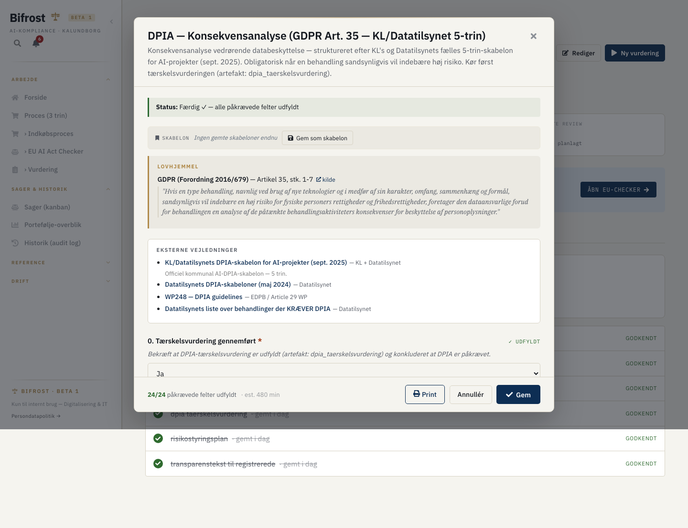

Klik et evidens-artefakt og en modal åbner med: status-badge (Færdig ✓),
skabelon-vælger (genbrug eller gem som skabelon), ordret GDPR Art. 35-citat,
links til KL's DPIA-skabelon + Datatilsynet + EDPB, og udfyldelige sektioner.
Footer'en har Print + Annullér + Gem.

### Glossary-tooltips på fagudtryk

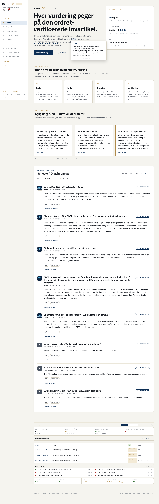

Hover (eller klik) på fagudtryk som "DPIA", "FRIA", "BETINGET-GO", "Bilag III"
hvor som helst i appen — lille popover med definition + lov-kilde + "Læs mere"-link.
30+ termer dækket. Designet til at gøre platformen brugbar for personer uden
juridisk baggrund.

### Portefølje-dashboard med live data

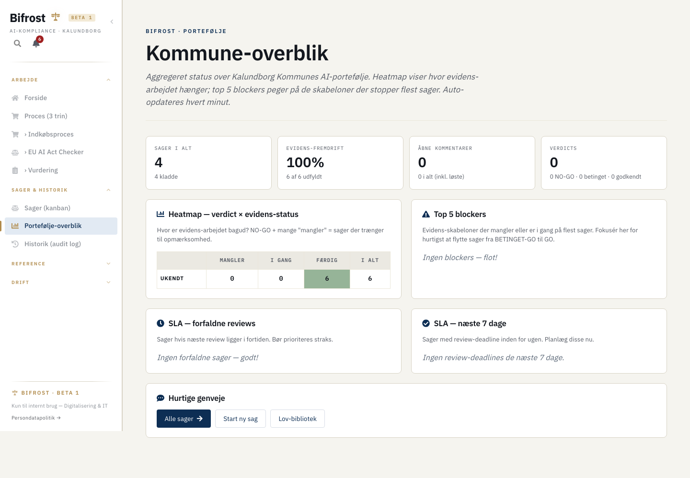

Når du har data: stats-strip viser 4 sager · 100% evidens · 0 åbne kommentarer.
Heatmap'en farver "Færdig"-kolonnen grøn når der ikke er røde flag.
Top blockers, SLA-lister og hurtige genveje er altid synlige.

### Notifikationer i bell-panelet

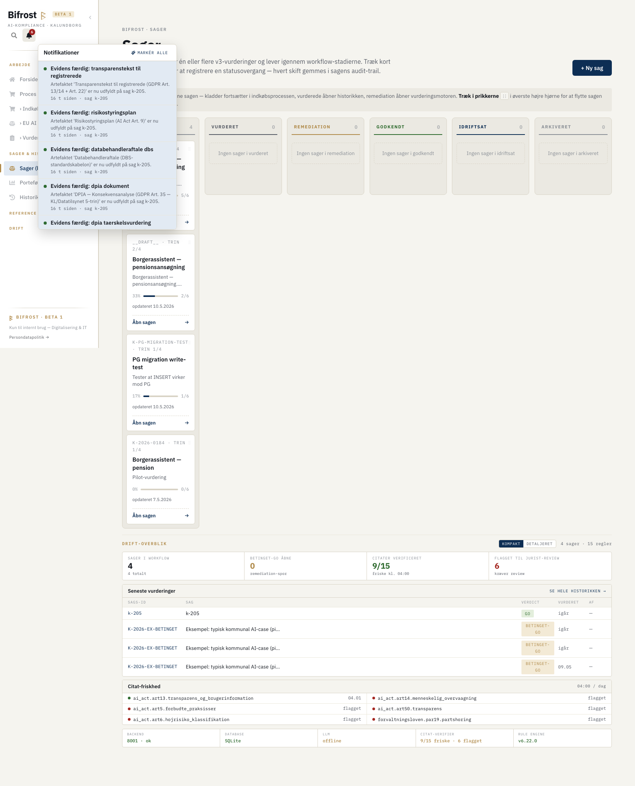

Bell i sidebar-header viser unread-badge (her 6 ulæste). Klik åbner panelet
via React Portal med viewport-aware positioning. Hver notifikation har
titel, beskrivelse, tidsstempel og direkte link til den relevante sag/evidens.
"Markér alle"-knap rydder badget.

### Print-version af en evidens

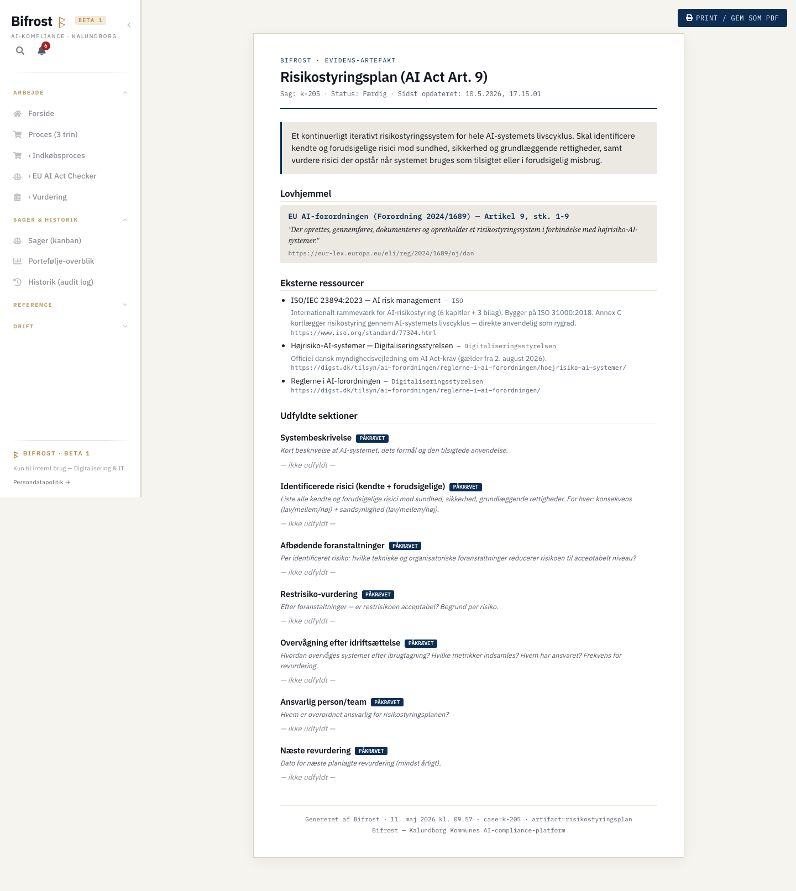

Klik Print i evidens-editoren → ny tab med print-venligt layout. Strukturen
spejler myndighedstilsyns-format: titel, status, sag-meta, opsummering,
lovhjemmel, eksterne ressourcer og hvert udfyldt felt. Cmd+P / Ctrl+P
giver perfekt PDF til kontrakter eller tilsynsmøder.

---

## Centrale features under motorhjelmen

### 28 curerede evidens-skabeloner

Hver påkrævet evidens (risikostyringsplan, DPIA, databehandleraftale, EU MCC-checklist,
AI-færdighedsprogram, trustworthy AI-vurdering, CE-mærkning, Art. 73 incident-reporting
m.fl.) er bygget af researched lov-citater + sektioner som sagsbehandleren udfylder.
Status beregnes automatisk (mangler / i_gang / færdig / godkendt).

### Skabelon-bibliotek

Når en sagsbehandler udfylder fx et AI-færdighedsprogram, kan det gemmes som
genbrugbar skabelon. Næste sag indlæser den med ét klik — eksisterende svar
bevares, tomme felter får skabelon-værdi.

### Per-felt kommentarer

Jurist og sagsbehandler kan diskutere et konkret felt i en evidens uden at forlade
Bifrost. Kommentarer dukker også op i sagens timeline + notifikationer.

### Glossary-tooltips

Hover over fagudtryk som "DPIA", "FRIA", "BETINGET-GO", "Bilag III" hvor som helst
i appen — lille popup med forklaring + lov-reference. 30+ termer dækket.

### Notifikationer + audit-trail

Hver sagshandling (evidens udfyldt, vurdering kørt, kommentar tilføjet) logges
uændret i audit-trailen og emitterer en notifikation til klokken i top-baren.

### Eksport: DOCX + PDF

Hele sagen — med intake-data, alle vurderinger, evidens og lovcitater — kan
eksporteres som strukturet Word-dokument (til redigering) eller print-klar PDF
(til myndighedstilsyn eller kontrakter). Per-evidens print-versioner findes også.

---

## Teknisk stack

Bifrost er bygget som en moderne web-applikation med strict separation mellem
**deterministisk regelmotor** og **LLM-assisterede UI-funktioner**. LLM'en må
aldrig træffe en afgørelse — kun udtrække signaler.

| Lag | Teknologi |
|-----|-----------|
| **Frontend** | React 18 + Styled Components + react-query + react-router |
| **Backend** | FastAPI (Python 3.11) + SQLAlchemy + Alembic + APScheduler |
| **Database** | PostgreSQL (primær) + Qdrant (vector store til RAG) |
| **Rule engine** | 21 deklarative YAML-regler under `rules/` |
| **LLM** | LM Studio (lokal, default `gpt-oss-20b`) → Azure OpenAI / OpenAI fallback |
| **Lov-data** | regelrytter.dk-sync (295 love) + EUR-Lex + Datatilsynet + EDPB |
| **Auto-updates** | Daglig KB-update kl. 03:00, ugentlig lov-citat-verifikation |

### Arkitekturprincipper

1. **Hjemmel før afgørelse** — Ingen vurdering vises uden et ordret lovcitat
2. **Deterministisk over LLM** — Regelmotoren kører YAML-regler, ikke LLM-fortolkning
3. **Lokal LLM først** — Default LM Studio (ingen data forlader kommunens netværk)
4. **Append-only audit** — Ingen sletning eller redigering af historik
5. **PII redaction by default** — CPR, e-mail, telefonnummer redigeres automatisk

Læs mere i [`docs/ARKITEKTUR.md`](docs/ARKITEKTUR.md), [`docs/DPIA.md`](docs/DPIA.md)
og [`docs/PRIVACY_POLICY.md`](docs/PRIVACY_POLICY.md).

---

## Installation (udviklere)

### Forudsætninger
- Python 3.11+
- Node.js 18+ og npm 9+
- PostgreSQL 14+ (lokalt eller via Docker)
- LM Studio (anbefalet) eller en `OPENAI_API_KEY` / Azure OpenAI-konfiguration

### Hurtigstart

```bash
# Klon
git clone https://github.com/Parthee-Vijaya/ai-jura.git bifrost
cd bifrost

# Backend
python3.11 -m venv venv
source venv/bin/activate
pip install -r requirements.txt
cp .env.example .env  # Udfyld DATABASE_URL + LLM-konfiguration
alembic upgrade head

# Frontend
npm install   # installerer både root og workspaces

# Start begge servere
./scripts/start_tyr.sh   # backend :8001, frontend :8090
```

Detaljerede produktions-instrukser findes i de tilhørende docs.

### Tests

```bash
# Backend
pytest                          # alle tests
pytest tests/test_evidence_artifacts.py -v   # 71 evidens-tests

# Frontend
cd frontend && npm test -- --watch=false
```

---

## Bidrag & ejerskab

**Ejer:** Kalundborg Kommune — Digitalisering & IT
**Repository:** [`Parthee-Vijaya/ai-jura`](https://github.com/Parthee-Vijaya/ai-jura) (privat)
**Licens:** Intern brug. Kontakt ejer for ekstern brug.

**Kontakt:**
- Persondata-spørgsmål: se [`docs/PRIVACY_POLICY.md`](docs/PRIVACY_POLICY.md)
- Tekniske spørgsmål: opret issue i repoet
- Pilot-deltagelse: kontakt Digitalisering & IT

---

## Roadmap (beta 2 → 1.0)

- [x] 28 curerede evidens-skabeloner (P1+P2 leveret 2026-05-10)
- [x] 3-trins proces med auto-save + sag-detalje
- [x] Portefølje-dashboard med heatmap + blockers + SLA
- [x] Skabelon-bibliotek + per-felt kommentarer
- [x] Glossary-tooltips (30+ termer)
- [ ] WCAG 2.1 AA accessibility-audit
- [ ] Cmd+K faceted search med saved searches
- [ ] Multi-bruger med RBAC (rolle-baseret adgang)
- [ ] Pilot med 3 forvaltninger (børn, beskæftigelse, sundhed)

Status: **beta 2** — kører internt på Mac Studio bag Tailscale.
Klar til intern pilot, ikke til ekstern publicering.
