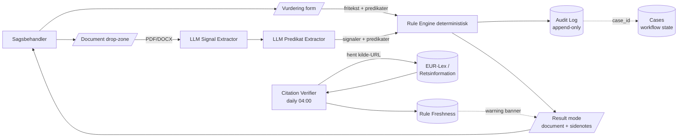

# Hjemmel — arkitektur-overblik

*Single-page reference til komponenterne og hvordan de hænger sammen.*

---

## High-level data-flow



---

## Komponent-oversigt

```
┌─────────────────────────────────────────────────────────────────────┐
│                         FRONTEND (React 18)                         │
│                   port 8090, Design C, Lora + SSP                   │
├─────────────────────────────────────────────────────────────────────┤
│                                                                     │
│   /                  /vurdering            /sager (kanban)          │
│   HomePage           V3VurderingPage       SagerPage                │
│       └── hero       ├── form                  ├── 6 kolonner       │
│       └── stats      ├── drop-zone             ├── drag-drop        │
│       └── cards      ├── 3 eksempler           ├── + ny sag modal   │
│                      └── result-mode           └── audit-trail      │
│                          ├── breadcrumb                             │
│                          ├── verdict-banner   /historik             │
│                          ├── regler           VurderingHistorikPage │
│                          ├── sidenotes            ├── tabel + filter│
│                          └── audit                └── /historik/:id │
│                                                                     │
│   /lov-overvaagning              /sammenlign                        │
│   LovOvervaagningPage            SammenlignPage                     │
│       ├── stat-kort                  ├── form                       │
│       └── tabel pr regel             └── 2-kolonne diff             │
│           (verificeret/flagget)                                     │
│                                                                     │
│   ┌─────────────────────────────────────┐                          │
│   │  Globalt: Sidebar + ⌘K palette +    │                          │
│   │  g-prefix shortcuts                 │                          │
│   └─────────────────────────────────────┘                          │
│                                                                     │
└──────────────────────────┬──────────────────────────────────────────┘
                           │ HTTP (proxy → backend)
                           v
┌─────────────────────────────────────────────────────────────────────┐
│                      BACKEND (FastAPI on port 8001)                 │
├─────────────────────────────────────────────────────────────────────┤
│                                                                     │
│   v3 endpoints:                                                     │
│   POST   /api/v3/assess              (form input → vurdering)       │
│   POST   /api/v3/document/analyze    (PDF/DOCX → vurdering)         │
│   GET    /api/v3/rules               (alle aktive regler)           │
│   GET    /api/v3/audit               (filtrerbar liste)             │
│   GET    /api/v3/audit/{id}          (fuld vurdering)               │
│   POST   /api/v3/cases               (opret sag)                    │
│   GET    /api/v3/cases               (liste m/filter)               │
│   GET    /api/v3/cases/{id}          (detalje + transitions)        │
│   POST   /api/v3/cases/{id}/transition (status-skift)               │
│   POST   /api/v3/compare             (legacy vs v3 diff)            │
│   GET    /api/v3/law/freshness       (citat-status pr regel)        │
│   POST   /api/v3/law/freshness/run   (manuel verifier-trigger)      │
│   GET    /api/v3/law/freshness/flagged (kompakt for warning-banner) │
│                                                                     │
│   Services:                                                         │
│   ├── src/rule_engine/                                              │
│   │     ├── loader.py        YAML + JSON Schema validator           │
│   │     ├── executor.py      deterministisk evaluator               │
│   │     ├── signal_extractor LLM fritekst → signaler + predikater   │
│   │     └── audit.py         V3AssessmentLog model                  │
│   ├── src/services/                                                 │
│   │     ├── document_analyzer  PDF/DOCX → chunks → signaler →       │
│   │     │                      predikater → rule_engine             │
│   │     └── citation_verifier  daglig fitness-funktion              │
│   └── src/database/                                                 │
│         ├── connection.py     SQLAlchemy + init_db                  │
│         └── cases.py          Case + CaseTransition state-machine   │
│                                                                     │
└──────────────────────────┬──────────────────────────────────────────┘
                           │
            ┌──────────────┼──────────────┬──────────────┐
            v              v              v              v
        SQLite/PG        rules/        APScheduler    LM Studio /
        (audit +         15 YAML +     (KB 03:00 +    Azure OpenAI /
         cases +         6 templates   verifier       OpenAI
         freshness)                    04:00)         (auto-prio)
```

---

## Tabel-skema (forenklet)

### `v3_assessment_log` (M0 — append-only)
```
id                   uuid PK
created_at           datetime
case_id              str (extern)         # K-2026-0184
user_id              str
rule_engine_version  str                  # 3.0.0-alpha.5
aggregate_status     str                  # GO | BETINGET-GO | NO-GO
rules_loaded         str                  # antal regler aktiv ved evaluering
request_payload      JSON                 # full input
response_payload     JSON                 # full output
note                 text
```

### `cases` (M2 — workflow)
```
id                       uuid PK
case_id                  str               # K-2026-0184 (extern)
title                    str
status                   enum              # kladde / vurderet / remediation /
                                          # godkendt / idriftsat / arkiveret
last_aggregate_status    str               # GO / BETINGET-GO / NO-GO (cached)
assigned_to              str
next_review_at           datetime
last_assessment_log_id   uuid              # FK til v3_assessment_log
notes                    text
created_at               datetime
updated_at               datetime
```

### `case_transitions` (M2 — append-only audit)
```
id            uuid PK
case_db_id    uuid FK → cases.id
changed_at    datetime
from_status   str | null   # null på første transition (creation)
to_status     str
note          text
changed_by    str
```

### `rule_freshness` (M3 — citat-status)
```
rule_id              str PK
last_checked_at      datetime
citation_found       bool
flagged_for_review   bool
http_status          int
error_message        text
source_url           text
snippet              text   # context fra kilden hvor citat blev fundet
```

---

## Sekvenser

### Vurdering via formular
```
Sagsbehandler → V3VurderingPage → POST /api/v3/assess
                                    │
                                    ├── _v3_load_rules() (cached)
                                    ├── extractor.extract(description, rules) [LLM]
                                    ├── evaluate_all(rules, input) [deterministisk]
                                    ├── audit.save_assessment() [append-only]
                                    └── return JSON
                                            │
                                            v
                                    Result-mode renders
```

### Vurdering via dokument-upload (M1 + M1.5)
```
Sagsbehandler → drop file → POST /api/v3/document/analyze
                              │
                              ├── parse_document(bytes) → text + offsets
                              ├── chunk_text(text, page_offsets)
                              ├── per chunk: extractor.extract() [LLM signal-pass]
                              ├── _merge_signals() → True wins
                              ├── evaluate_all() [first pass]
                              ├── triggered → extractor.extract_predicates_for_rule() [LLM predikat-pass]
                              ├── evaluate_all() [second pass with predikater]
                              ├── audit.save_assessment(kind="document")
                              └── return JSON
                                      │
                                      v
                              Result-mode + chunks-attribution + extracted-predicates
```

### Citation verification (daglig)
```
APScheduler @ 04:00 → _v3_run_citation_verifier()
                        │
                        ├── _v3_load_rules()
                        ├── for each rule:
                        │     ├── verify_rule(rule)           [httpx GET]
                        │     │     ├── normalize HTML
                        │     │     ├── search citat as substring
                        │     │     └── return VerificationResult
                        │     └── persist_result(session, result)  [DB upsert]
                        └── log "X verified, Y flagged"
```

### Frontend warning-banner i Vurdering
```
V3VurderingPage mounts
  └── useQuery('v3-flagged-rules', fetchFlaggedRuleIds, staleTime=5min)
        └── GET /api/v3/law/freshness/flagged
               └── flagged_rule_ids() returns Set<rule_id>

På result-mode:
  if (decisions.find(d => flaggedRuleIds.includes(d.rule_id)))
    render <FlaggedBanner>
```

---

## Tech stack

| Lag | Tech |
|---|---|
| Frontend | React 18 + react-query + react-router + styled-components + framer-motion |
| Backend | FastAPI + Pydantic v2 + SQLAlchemy 2 + APScheduler + httpx |
| LLM | LM Studio (lokal, gemma/openai/llama) → Azure OpenAI → OpenAI (auto-prio) |
| Database | SQLite (dev) / PostgreSQL (prod) |
| Frontend fonts | Lora · Source Serif Pro · Inter · JetBrains Mono |
| Dev tools | Vite-style HMR via react-scripts; concurrently for npm run dev |

---

## Vigtige design-beslutninger

1. **LLM må aldrig ændre afgørelsen** — kun udtrække signaler og predikater fra fritekst. Selve compliance-afgørelsen er deterministisk og kan reproduceres.

2. **YAML regler er authoritative** — ingen rule kan oprettes/ændres via API; den skal commits til repository. Det giver git-historik på enhver compliance-ændring.

3. **Citation-verifier som fitness-funktion** — vi kan ikke garantere at vores citater er rigtige, men vi kan dagligt verificere at de stadig findes i kilden. Det er en *bevisbar* friskhed, ikke et "dette vist'nok stadig gælder".

4. **Audit-log er append-only** — workflow-state ligger i `cases`-tabellen ovenpå. Audit-loggen kan aldrig modificeres, kun læses.

5. **Cream-paper Design C** — autoritets-signal til kommunale jurister. Ikke "tech-startup" æstetik.

6. **Single-tenant i v1** — multi-tenant kræver fundamentalt anderledes auth/isolation. Det er en separat arkitektur.
